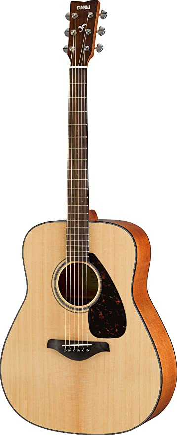

## How to connect: Recording an electric guitar or bass with an amplifier

### Introduction

My name is Álvaro from Chile. I started playing the guitar when I was 12 years old and bass nearly at 16. Always has been a challenge recording my riffs into a digital format. Here I show some guidelines on how to do it, depending on the gear required.

### Lesson

You will need:

* An electric guitar or bass
* 1/4" TS cables
* XLR cables
* An USB Interface
* An amplifier
* Microphone
* Microphone stand

There are many options on how to connect the instrument into the computer via Interface. Firstly I will show two basic ways without amplifier to show some pro's and con's.

#### Option 1: Direct

Guitar -> 1/4 Ts" cable -> Audio interface

In this case you will need in your interface an input named: Instrument, direct or High Z (impedance), as the signal is not as the same as line level.

This configuration is really easy to achieve but could get some undesired delay and latency.

Probably you will need to add some plugins in your DAW to get different sounds and tones. There are some plugins that adds conventional guitar and bass effects to the signal such as: ToneLib, Guitarix and Amplitube.

#### Option 2: With an pedalboard

Guitar -> 1/4 Ts" cable -> PEDAL -> 1/4 Ts cable -> Audio interface

Same as before, but with an pedalboard between the guitar and the audio interface.

It helps with the tone and sound by adding effects to the signal. An amplifier/cabinet simulator could be useful to emulate the real sound of an amplifier, as you are not using one. 

#### Option 3: Mic and amplifier

Guitar -> 1/4 Ts cable -> Guitar or bass amp - > Mic -> XLR Cable -> Audio interface in MIC input

If you have a microphone, you are able to get the sound of the amplifier, and try different positions to get your desired sound. You also have to take into consideration the room acoustics and external noise.

#### Option 4: Amplifier line out 

Guitar -> 1/4 TS" cable -> Amp -> Line out -> 1/4 Ts cable -> Line in

Some amplifiers and cabinets have an Line out. This is a signal coming after the amplifiers gain and equalization that could be sent into another device. It is possible to take that signal and send it into the interface.

WARNING: Do not connect speaker labeled outputs into an interface, as the signal is to powerful to be used. 

#### Option 5: Direct box

Guitar -> 1/4" TS Cable -> Direct Box -> Amp
				      -> XLR cable -> Audio Interface

With the use of a direct box, you could send the signal into the interface and also send it into an amplifier. So you can hear the sound that are you recording with no latency.

It also helps from the noise by keeping comparable impedances. 

#### Option 6: Additional amplifier signal

Same as the option 5, but adding a second microphoned signal into the interface.

Could be useful, if you would like to layer some tracks or modify your tone.

### Reflection

These are some methods to record an electric guitar/bass with an amplifier. Always try to fit your sound requirements with your gear. Don't expect to much quality if you don't have all the equipment required. 

In my case, I record most of the times with my pedalboard. I don't have a dedicated microphone, good amplifier or good room acoustics, but I get a decent sound for my songs with a low budget.

